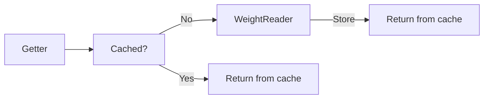

# Data Manipulation

Heavy Inventories employs a complex but highly efficient way of handling data. Whether it be in the form of JSON files
or physically stored on the computers RAM, all data is always present for the mod.

When reading weights, they are stored in two ways

The getter method implements a check function that gets values from a memory stored location that contains weight data.
If nothing is stored for the specific item in the RAM, the WeightGetter will be called to retrieve the weight. Storing the
weight in the RAM is more efficient because it requires the hard disk to do fewer operations, resulting in faster get times
especially when there are multiple items being requested at once. Items stored in the players inventory will always be
stored in the RAM.

### Wouldn't this use up a lot of RAM?
Yes and no. The data is written to a list that is capped at 99 slots. Periodically, the RAM will be cleared of this stored
data when it goes cold, meaning if the item is no longer in the players inventory for a long period of time, it will be 
cleared. 
